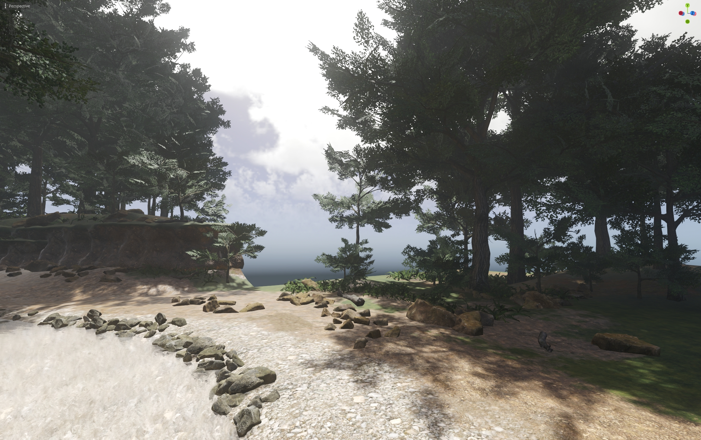

# Open forest benchmark

This is a benchmark project for Godot 4. Its goals are:
- Provide a complex scene for Godot developers used for optimizing the engine
- Showcasing graphical capabilities of Godot
- Reference point of complex and optimal game graphics

It is made using free assets, the sources for assets are listed in `Asset Credits.txt`.
The project is **work in progress**.

## To do list:

- Expand the scene to be larger scale, suitable for a game scene
- Add groundcover, generated based on ground's textures (controlled by vertex color)
- Add more assets
- Look into optimizing the assets

## Contributing the assets:

The project needs more assets and any help is appreciated. Assets can come from the free asset sources or be made by yourself.
Assets must be PBR, be optimized for game and graphically fit to the rest of the scene.
They must have free license allowing them to be used in open source project. It doesn't allow sources such as Textures.com (its license forbids use in open source projects) and AI generated assets (it's full of ethical issues).

